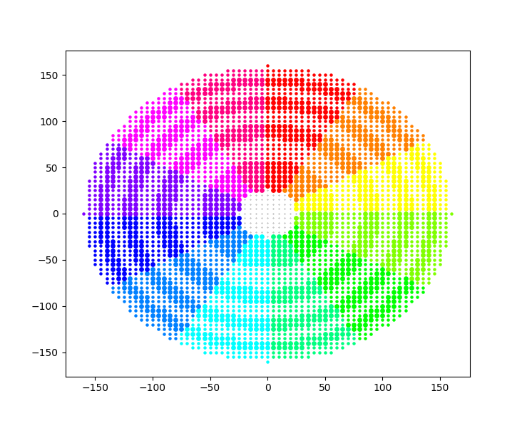

# Bassin Versant Calculator - Utilisation

Ce README explique le fonctionement du dossier `bassin_versants`.
Cette partie du projet envergo vise à produire des cartographies de bassin versant en se basant sur les cartographies RGE alti d'IGN.

## Comment l'utiliser
Dans cette section, nous verrons comment utiliser le code pour génrer des cartographies. Pour celà, il faudra d'abord récupérer des données RGE alti d'ign :

### Récupérer les données d'altimétrie
#### Télécharger les données
Les données peuvent être récupérées à [cette adresse](https://geoservices.ign.fr/rgealti#telechargement5m). Nous choissons 5m de précision car c'est suffisant pour le calcul et permet de diminuer l'espace nécessaire pour stocker les cartos.

Vous pouvez cliquer sur le lien ou les récuper via wget :
```
wget -O <nom_de_l'archive> <url>
```
Attention cependant à bien remplacer les `$` par `\$` car wget interprête sinon la suite comme une variable shell.
Ne pas oublier d'ajouter .7z à la fin du nom de fichier pour windows.


Une fois les données récupérés, il faut les décompresser, soit via le systèmes de fichiers de votre oridnateur, soit en ligne de commande avec 7zip :
1. Installer 7zip command line :
- mac : `brew install p7zip`
- linux : `sudo apt install p7zip p7zip-full p7zip-rar`
- windows : installé par défaut normalement

2. Deziper l'archiver vers la bonne destination
```
7z x <nom_de_l'archive> -o<dossier_de_destination_des_cartos>
```
nb : pas d'espace entre le o et le nom de dossier
Une fois le dossier décompressé, les données d'altitude se trouvent dans
dossier_de_destination/RGE_ALTI\[...]/1_DONNEES_LIVRAISON_\[...]/RGE_ALTI\[...]/

Tip : dans vscode, pour récupérer ce nom de chemin : clic droit sur le dossier > `copy relative path`

### Lancer le calcul
vous pouvez alors directement lancer le calcul pour toutes les cartos disponibles :

Depuis la racine du projet :
1. Installer les dépendances :
```
python3 -m pip install -r envergo/utils/bassins_versants/requirements.txt
```
2. Lancer le programme :
```
python3 envergo/utils/bassins_versants/mass_carto_creation.py \
    --input-folder <dossier_de_destination_des_cartos>/RGE_ALTI/1_DONNEES_LIVRAISON_[...] \
    --output-folder <dossier de destination des calculs de bassin versant> \
```
Cela va générer des cartes de bassin versant au format asc et les stocker dans "output-folder" , en suivant les coordonnées des cartes fournies dans le dossier "input-folder"

# Bassin Versant Calculator - Lancer des tests de benchmark de paramètres :

1. Définir des jeux de paramètres, par exemple
```
p1_12 = bassinVersantParameters(
    carto_precision=5,
    inner_radius=25,
    radii=[50, 70, 90, 110, 130, 145, 160],
    quadrants_nb=12,
    slope=0.05,
)
```
2. Definir des comparaisons, par exemple
```
f = (p1_16, p1_12)
```
Nb : l'utilisation de lettres pour la nomenclature des comparaisons correspond à la nomenclature excel utilisée avec Nicolas

3. Définir des cartos sur lesquelles effectuer les comparaisons, par exemple :
```
places_to_evaluate = [
    [
        "44",
        f"{ALTI_PARENT_FOLDER}/alti_data/rgealti_fxx_0285_6710_mnt_lamb93_ign69.asc",
    ],
    [
        "39",
        f"{ALTI_PARENT_FOLDER}/alti_data_39/rgealti_fxx_0890_6625_mnt_lamb93_ign69.asc",
    ],
    [
        "29",
        f"{ALTI_PARENT_FOLDER}/alti_data_29/rgealti_fxx_0215_6845_mnt_lamb93_ign69.asc",
    ],
]
```
On précise ici le département en premier (utile pour trier les fichiers de sortie ensuite) et l'adresse du fichier de carto ensuite pour récupérer les données.

Ensuite, il suffit de lancer le fichier [parameters_benchmark.py](parameters_benchmark.py), par exemple avec `python3 parameters_benchmark.py`

Il se peut que certains dossiers manquent au moment de lancer le programme. Il faut avoir une arborescence du type :
```
/output
  |
  |-- /benchmark
```
A l'endroit où se lance le fichier python.

# Bassin Versant Calculator - Fonctionnement de l'algorithme

## Les quadrants
POur le calcul du bassin versant en 1 point, on divise l'espace en quadrants (12 dans l'image - obtenue grâce à `plot_quadrants()` dans `visualizations.py`) eux même divisés en sections séparée par des rayons, ici :
```
rayon interne : 25m (~2000m^2 de surface interne)
rayons suivants : [59, 81, 98, 113, 126, 138, 149, 160]
```


## L'algorithme du bassin versant
Pour chaque quadrant, on va alors vérifier section par section si l'altitude moyenne des points d'une section est supérieure à l'altitude moyenne des points de la section précédente, en prenant en compte un critère de pente (pour l'instant fixé à 5% après benchmark des paramètres). Si le critère de pente est respecté, on ajoute la surface de la section à la surface de bassin versant, et on passe à la section suivante. Si ce n'est pas respecté, on passe au quadrant suivant.

Le dernier rayon des sections est 160m, ce qui permet à chaque quadrants de représenter 1ha lorsqu'il y a 12 quadrants, et ainsi de remplir le critère de la loi 2150 à lui tout seul le cas échéant.

## L'algorithme de création de carto
Pour créer une cartographie de bassin versant, on applique donc ce calcul pour tous les points d'une cartographie (avec un maillage de 20m pour l'instant, car plus précis n'est pas forcement pertinent et plus long à calculer.)

Pour accélerer les calculs, quelques optimisations:
- la "big Carto" de l'objet cartoQuerier est un agrégat de la carto considérée avec ses cartos voisines, pour permettre de récupérer toutes les altitudes d'une section d'un coup sans problème d'effet de bord et en tirant parti des fonctions numpy. -> gain non proportionnel mais de plus en plus signifcatif au fur et à mesure que le nombre de points moyen par section augmente.
- les points des quadrants sont stockés sans origines et ensuite décalés en fonction du point souhaité, pour ne pas recalculer les points que l'on voit dans l'image ci dessus à chaque itération. -> gain proportionnel au nombre de points évalués


# Bassin Versant Calculator - Composants par fichiers

Ces explications sont aussi présentes dans les docstrings des fonctions, mais elles permettent ici une meilleure vue d'ensemble.

## carto.py

### Paramètre
- Un objet [`Parameter`](create_carto.py), contenant les paramètres nécessaires pour exécuter les calculs.
     - cartoPrecision: int
     - innerRadius: int
     - radii: List[int]
     - quadrantsNb: int
     - slope: float


### différentes fonctions
- Certaines fonctions utilitaires pour manipuler les cartes dans [carto.py](utils/carto.py):
  - `get_carto_info` pour obtenir les informations d'en-tête d'un fichier .asc d'altimétrie
  - `load_carto` pour obtenir ses données sous forme d'un tableau numpy 2D
  - `get_bottom_left_corner` pour obtenir les coordonnées Lambert93 du coin inférieur gauche de la carte
  - `save_list_to_carto` pour enregistrer une liste python 1D dans une carte .asc
  - `save_array_to_carto` pour enregistrer un tableau np 2D dans une carte .asc
  - `create_quadrants` pour créer une liste de listes de points contenant les coordonnées des points à interroger afin d'exécuter le calcul du bassin versant, séparés par quadrants et entre rayons.
  - `update_origin` pour changer l'origine d'un point par un décalage fourni en entrée.

## carto_querier.py
- Un objet [`cartoQuerier`](utils/carto_querier.py), contenant les données de 9 tuiles cartographiques alti RGE, facilitant le processus d'interrogation de l'altitude de chaque point.
   - Cet objet possède une méthode `get_mean_alti` qui lui permet d'interroger plusieurs points en même temps dans son tableau numpy 2D `big_carto`, contenant les 9 tuiles cartographiques alti RGE, et de renvoyer la moyenne.
   - `fit_to_big_carto` est utile pour convertir les coordonnées Lambert 93 en coordonnées dans le tableau `bigCarto`.
   - `query_one_point` est utilisé pour interroger l'altitude d'un seul point.

## bassin_versant.py
- Dans [bassin_versant.py](utils/bassin_versant.py) , on a le calcul du bassin versant pour un point qui se fait avec la fonction `calculate_bassin_versant_one_point`. Cette fonction utilise d'autres sous fonctions :
  - `get_surface` pour obtenir la valeur de la surface d'une section de disque entre deux rayons
  - `check_elevation_diff` pour vérifier si la différence d'altitude remplit le critère de pente fixé en paramètre
  - `next_quadrant_check` qui permet d'appliquer le critère de pente aux quadrants de manière récursive, en cumulant la surface de bassin versant.

## mass_carto_creation.py
[mass_carto_creation.py](utils/mass_carto_creation.py) contient la fonction `mass_carto_creation`. Cette fonction prend en argument un dossier d'entrée et un dossier de sortie. Elle analyse les cartes alti RGE du dossier d'entrée, et pour chaque carte, elle crée une nouvelle carte de bassin versant dans le dossier de sortie. Un argument supplémentaire est la précision de la carte de sortie (par défaut, fixée à 20m comme décidé avec Nicolas).

Il y a également un argparse à l'intérieur de mass carto creator pour exécuter facilement la génération de cartes pour un département entier. Il semble que cela puisse être exécuté en même temps dans différents terminaux si vous avez plusieurs cœurs. Son fonctionnement est expliqué ci-dessus (comment l'utiliser).

## visualizations.py
[visualizations.py](utils/visualizations.py) est essentiellement un fichier de test manuel, permettant aux développeurs de vérifier le comportement des fonctions décrites précédemment. Ses fonctions produis
